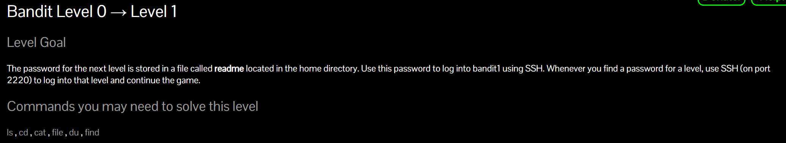
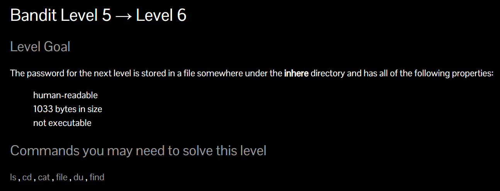
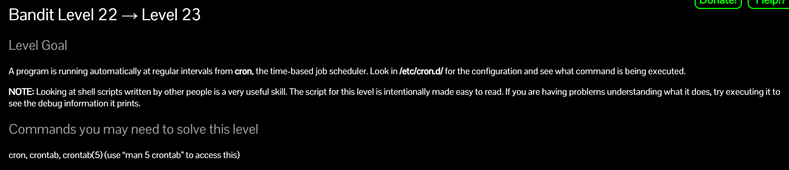

# Tạ Minh Quân - CTV Ban Chuyên Môn - EHC Challenges

Đây sẽ là toàn bộ writeup về challenge *OverTheWire: Bandit* của EHC giao trong kì thử thách đối với cộng tác viên ban chuyên môn của CLB


Sau khi đọc yêu cầu, mình đã tiến hành cài đặt Ubuntu 20.04 TLS trên vmware workstation 17


# Level 1



Đến với level đầu tiên, chúng ta được yêu cầu đọc file readme để lấy flag và flag chính là mật khẩu của challenges tiếp theo

Và chúng ta đã tìm thấy cờ sau khi đọc file readme bằng lệnh *cat*


*FLAG : NH2SXQwcBdpmTEzi3bvBHMM9H66vVXjL*

# Level 2


Ở level 2, chúng ta phải tìm được flag được dấu ở một file có tên là - ở home directory. Sử dụng flag bài trước đề login vào, vì đã biết chính xác tệp - nằm ở home directory nên mình  sẽ sử dụng lệnh *cat ./-* để đọc nội dung file -


*FLAG : rRGizSaX8Mk1RTb1CNQoXTcYZWU6lgzi*

# Level 3


Đến với level 3, họ yêu cầu chúng ta tìm flag ở trong một file, điều cần lưu ý ở bài này đó là file này có tên chứa các ký tự spaces. Và để xử lý bài này, chúng ta vẫn sử dụng lệnh cat nhưng cần đóng ngoặc kép.

```python
cat "file name"
```


*FLAG : aBZ0W5EmUfAf7kHTQeOwd8bauFJ2lAiG*

# Level 4


Ở chall này, đề bài yêu cầu mình tìm flag ở trong folder inhrere và file này đã bị ẩn đi. Vì vậy nếu chúng ta sử dụng lệnh *ls* thôi thì sẽ không tìm thấy file hidden này. Cho nên chúng ta sẽ sử dụng lệnh sau :

```python
ls -la 
```


*FLAG : 2EW7BBsr6aMMoJ2HjW067dm8EgX26xNe*

# Level 5


Bài này chúng ta cần tìm flag ở file trong inhere folder. Nhưng vấn đề là chỉ trong inhere có rất nhiều file khác nhau và trong chúng chỉ có một file chứa flag, còn lại đều là file chứa các ký tự không thể đọc được

Và để giải quyết nó, chúng ta có thể sử dụng lệnh *file* để xem định dạng file của các tệp này là gì

```python
file ./*
```


Như bạn đã thấy, chỉ có duy nhất file07 là có định dạng mã ASCII text, vì thế nên chúng ta sẽ cat file07 để xem flag


*FLAG : lrIWWI6bB37kxfiCQZqUdOIYfr6eEeqR*

# Level 6



Ở bài này, chúng ta cần tìm mật khẩu ở một file trong folder inhere dựa trên các thông số như sau :

- human-reaadable
- 1033 byte in size
- not executable

Dựa vào những thông tin trên, mình có thể sử dụng lệnh find để tìm. Cụ thể như sau :
```
find -size 1033c
```

- Với -size là kích thước của file
- 1033c là số byte với c là đơn vị của byte


Sau khi sử dụng lệnh find thì ta đã tìm ra flag ở folder maybehere07 nằm ở .file2

*FLAG : P4L4vucdmLnm8I7Vl7jG1ApGSfjYKqJU*

# Level 7


Với các hint mà để bài cho, mình sử dụng ngay lệnh find dựa trên các thuộc tính bên dưới :

```
find / -user bandit7 -group bandit6 -size 33c 2>/dev/null
```

- Lưu ý nhỏ ở đây mình thêm 2>/dev/null bởi vì khi tìm ở thư mục gốc, họ để rất nhiều file có thông số như bên trên nhưng không cho mình quyền đọc, vì vậy mình chuyển hướng các file permission decined đó về null và chỉ trả lại file duy nhất có thể đọc được


*FLAG : z7WtoNQU2XfjmMtWA8u5rN4vzqu4v99S*

# Level 8


Bài này chúng ta cần tìm flag ở trong file data.txt, và hint ở đây đó chính là nó nằm kế tiếp từ *millionth*

Để giải quyết chúng ta có thể sử dụng lệnh grep để tìm :

```
cat data.txt | grep millionth
```


*FLAG : TESKZC0XvTetK0S9xNwm25STk5iWrBvP*

# Level 9


Bài này sau khi cat file data.txt, nó cho ra một đoạn chuỗi ký tự rất dài và lộn xộn, chính vì thế nên ta cần sử dụng kết hợp 2 lệnh :
```
sort data.txt | uniq -u
```

- sort có chức năng sắp xếp các dòng theo bảng chữ cái trong file data.txt
- uniq -u có chức năng hiển thị các dòng xuất hiện một dòng duy nhất 


*FLAG : EN632PlfYiZbn3PhVK3XOGSlNInNE00t*

# Level 10


Bài này cũng tương tự bài trước, chúng ta có thể dùng grep để tìm flag. Vấn đề ở đây chính là nếu dùng cat, chúng ta sẽ đọc được nội dung bên trong file data.txt. Nhưng ở đây file data.txt lại hiển thị dữ liệu dưới dạng nhị phân và grep thì không thể tìm được dữ liệu ở nhị phân. Vì vậy nên ta có thể dùng strings để đổi dữ liệu sang strings.

```
strings data.txt | grep "===="
```


*FLAG : G7w8LIi6J3kTb8A7j9LgrywtEUlyyp6s*

# Level 11


Với bài này, họ yêu cầu chúng ta phải giải mã flag nằm trong file data.txt dưới dạng base64. Chúng ta có thể sử dụng lệnh *base64* để decode đoạn mã này

```
base64 -d data.txt
```


*FLAG : 6zPeziLdR2RKNdNYFNb6nVCKzphlXHBM*

# Level 12


Ở bài này, đề bài yêu cầu tìm flag trong file data.txt, nhưng flag sẽ được mã hóa bằng ROT13. Nghĩa là các chữ cái từ a-z, A-Z sẽ được thay thế bằng các từ cách nó 13 đơn vị. Để giải quyết bài này, chúng ta có thể sử dụng lệnh *tr*

```
cat data.txt | tr abcdefghijklmnopqrstuvwxyzABCDEFGHIJKLMNOPQRSTUVWXYZ nopqrstuvwxyzabcdefghijklmNOPQRSTUVWXYZABCDEFGHIJKLM
```


*FLAG : JVNBBFSmZwKKOP0XbFXOoW8chDz5yVRv*

# Level 13


Đọc qua đề thì ta có thể thấy đây là một bài mà flag nằm trong các file zip và chúng ta cần phải tìm ra nó. Làm theo yêu cầu của đề bài, ta cp và mov file qua thư mục tmp


Cat file ra thì thấy file ở dạng hex, chúng ta cần chuyển nó về dạng binary và dùng gzip để giải nén


Cứ tiếp tục giải nén và file để xem định dạng file đến lần thứ 9. Chúng ta đã có flag


*FLAG : wbWdlBxEir4CaE8LaPhauuOo6pwRmrDw*

# Level 14


Chúng ta tiến hành kết nối SSH với sshkey.private

```
ssh -p 2220 -l bandit14 -i sshkey.private bandit.labs.overthewire.org 
```

Sau đó dựa vào đề bài nói flag nằm ở etc/bandit_pass/bandit14 nên ta sẽ cat file đó


*FLAG : fGrHPx402xGC7U7rXKDaxiWFTOiF0ENq*

# Level 15


Đề bài yêu cầu gửi mật khẩu ở trên cổng 30000. Chúng ta sẽ sử dụng lệnh *nc*

```
nc localhost 30000
```


*FLAG : jN2kgmIXJ6fShzhT2avhotn4Zcka6tnt

# Level 16


Ở bài này ta cần gửi mật khẩu tới cổng 30001 qua giao thức ssl. Ta sử dụng openssl để giải quyết

```
openssl s_client localhost:30001
```


*FLAG : JQttfApK4SeyHwDlI9SXGR50qclOAil1*

# Level 17


Cũng giống như bài trên nhưng port sẽ nằm trong khoảng từ 31000 - 32000 nên chúng ta sẽ dùng nmap để scan

```
nmap -sV -TS -p 31000-32000 localhost
```

Đợi một chút, chúng ta đã quét ra 2 cổng ssl


Sử dụng openssl giống như bài trước và ta có file RSA encryption. Lưu nó lại thành file sshkey và sử dụng ssh để truy cập


*FLAG : VwOSWtCA7lRKkTfbr2IDh6awj9RNZM5e*

# Level 18


Chúng ta cần tìm đoạn mã duy nhất không bị thay đổi trong 2 file password.old và password.new

Ta có thể sử dụng lệnh diff để tìm ra chúng


*FLAG : hga5tuuCLF6fFzUpnagiMN8ssu9LFrdg*

# Level 19


Sau khi đăng nhập bằng ssh, mình ngay lập tức bị disconnect ra. Vậy nên mình thử cat file khi đăng nhập vào thì có được flag


*FLAG : awhqfNnAbc1naukrpqDYcF95h7HoMTrC*

# Level 20


Đề bài yêu cầu chúng ta chạy file *bandit20-do* nhưng lưu ý ở đây là phải sử dụng setuid. Khi sử dụng setuid để thực thi file, chúng ta sẽ trở thành chủ sở hữu tạm thời của file đó


*FLAG : VxCazJaVykI6W36BkBU0mJTCM8rR95XT*

# Level 21


Đề bài yêu cầu  tạo kết nối với localhost trên cổng bạn Chỉ định làm đối số dòng lệnh. Sau đó, nó đọc một dòng văn bản từ kết nối và so sánh nó với mật khẩu ở cấp độ trước

Vậy nên mình sử dụng cổng 6969 và đẩy flag của bài trước lên. Sau đó dùng để so sánh nó với mật khaaurr mới


*FLAG : NvEJF7oVjkddltPSrdKEFOllh9V1IBcq*

# Level 22


Bài này mình spam cat theo hint của bài và ra được flag :)


*FLAG : WdDozAdTM2z9DiFEQ2mGlwngMfj4EZff*

# Level 23



Cũng tương tự như bài trên nhưng ta thay username bằng username bandit23 và sử dụng md5sum để decode


*FLAG : 8ca319486bfbbc3663ea0fbe81326349*

# Level 24


Giống bài trước, thực hiện yêu cầu đề bài nên mình sẽ cd và cat file *cronjob_bandit24.sh* xem có gì


Sau đó bạn tiếp tục thực hiện theo yêu cầu là cat file đến directory trong bandit24.sh, và cấp quyền cho nó


*FLAG : VAfGXJ1PBSsPSnvsjI8p759leLZ9GGar*

# Level 25


Bài này ta sử dụng bruteforce để xử lý theo yêu cầu của đề bài, ta sử dụng vim và cấp quyền thực thi là có thể hoàn thành

Tạo một file bash trong tmp có nội dung như sau để tạo ra bruteforce


Cấp quyền chmod 777


Chạy file quan.sh


*FLAG : p7TaowMYrmu23Ol8hiZh9UvD0O9hpx8d*

# Level 26


Đầu tiên bạn cần thu nhỏ terminal lại, sau đó truy cập login ssh bằng command bên dưới :

```
ssh -i bandit26.sshkey -p 2220 -l bandit26 bandit.labs.overthewire.org
```

Ấn v để chuyển sang vim sau đó nhập lệnh

```
:set shell =/bin/bash 
:shell
```

Dùng lệnh cat để đọc flag trong file text.txt

```
cat /etc/bandit_pass/bandit26
```


*FLAG : c7GvcKlw9mC7aUQaPx7nwFstuAIBw1o1*

# Level 27


Thu nhỏ terminal lại, tiếp theo sử login vào ssh và nhấn v để mở command của vim. Sau đó nhập : 
```
:set shell =/bin/bash 
:shell
```

Như vậy là ta đã đăng nhập ssh thành công. 


*FLAG : YnQpBuifNMas1hcUFk70ZmqkhUU2EuaS*

# Level 28


Chúng ta sẽ được làm quen với lệnh git ở bài này. Ta git clone repo của bài yêu cầu về bằng lệnh : 
```
git clone ssh://bandit27-git@localhost:2220/home/bandit27-git/repo
```


Đọc file README trong repo


*FLAG : AVanL161y9rsbcJIsFHuw35rjaOM19nR*

# Level 29


Giống bài trước, tiếp tục git clone repo về và đọc file README


Có vẻ như không tìm thấy flag trong này, chúng ta hãy xem những commit của file này xem có sự thay đổi như nào bằng lệnh :
```python
git log
```


Ta cùng xem commit cuối cùng này bằng :

```
git show
```


*FLAG : tQKvmcwNYcFS6vmPHIUSI3ShmsrQZK8S*

# Level 30


Làm y hệt như các bước vừa rồi


Không có flag trong này, nên chúng ta hãy check xem các branch của nó có gì không bằng lệnh : 

```
git branch -a
```

Checkout hết nội dung folder dev bằng lệnh :

```
git checkout remotes/origin/dev
```


*FLAG : xbhV3HpNGlTIdnjUrdAlPzc2L6y9EOnS*

# Level 31


Chúng ta có thể dùng lệnh sau để xem chi tiết nhãn repo này :

```
git tag
```


*FLAG : OoffzGDlzhAlerFJ2cAiz1D41JW1Mhmt*

# Level 32


Đối với bài này ta cần sử dụng git push


git upload và git push thêm lần nữa ta được flag


*FLAG : rmCBvG56y58BXzv98yZGdO7ATVL5dW8y*

# Level 33


Bài này chúng ta có thể sử dụng $0 vì $0 biểu diễn cho một shell hay bắt đầu của một shell


*FLAG : odHo63fHiFqcWWJG9rLiLDtPm45KzUKy*

# Level 34


??? 404 Not Found

# Lời Kết

<details>
  <summary>Đừng nhấn</summary>
  
  Em yêu EHC <3
  
</details>
